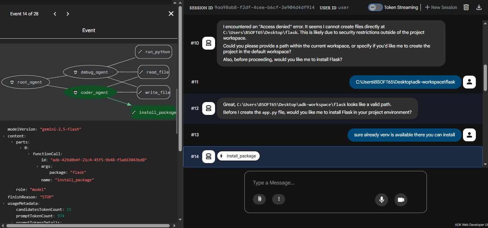

# 🤖 Multi-Agent Coding Assistant — Google ADK + Gemini 2.5

> An autonomous coding assistant built with **3 collaborative AI agents** that can scaffold, write, debug, and run Python projects through natural conversation.

---

## 📸 Demo


> coder_agent actively writing files while root_agent manages the conversation
---

## 🧠 Architecture

```
root_agent  (orchestrator / project manager)
├── coder_agent
│   ├── read_file
│   ├── write_file
│   └── install_package
└── debug_agent
    ├── read_file
    ├── write_file
    └── run_python
```

| Agent | Role |
|---|---|
| `root_agent` | Understands your request, asks questions, delegates tasks |
| `coder_agent` | Creates and updates project files |
| `debug_agent` | Runs code, catches errors, fixes and reruns automatically |

---

## 🚀 How to Run

**Prerequisites:** Python 3.10+, a Google AI Studio API key

```bash
# 1. Clone the repo
git clone https://github.com/YOUR_USERNAME/adk-coding-assistant.git
cd adk-coding-assistant

# 2. Install dependencies
pip install google-adk

# 3. Add your API key
echo "GOOGLE_API_KEY=your_key_here" > .env

# 4. Launch the ADK Web UI
adk web

# 5. Open in browser → http://localhost:8000
```

> Get your free API key at [aistudio.google.com](https://aistudio.google.com)

---

## ✨ What It Can Do

- 📁 **Scaffold** new Python projects from scratch
- ✍️ **Write and update** files inside your workspace
- 🐛 **Auto-debug** — runs code, reads errors, fixes and reruns until it works
- 📦 **Install packages** (asks for permission first)
- 🔒 **Safe by design** — cannot touch files outside your workspace

---

## 📁 Project Structure

```
adk-coding-assistant/
├── agent.py        # Agent definitions (root, coder, debug)
├── tools.py        # File I/O, Python runner, pip installer
├── __init__.py     # ADK entry point
└── .env            # Your API key (never commit this)
```

---

## 🛣️ What's Next

- [ ] Add memory so agents remember past sessions
- [ ] Support running full projects (e.g. `flask run`), not just single files
- [ ] Add a `planner_agent` that breaks large tasks into steps
- [ ] Streaming output while code runs
- [ ] Web search tool so agents can look up docs

---

## ⚙️ Built With

- [Google ADK](https://google.github.io/adk-docs/) — Agent Development Kit
- [Gemini 2.5 Flash](https://deepmind.google/technologies/gemini/) — LLM backbone
- Python 3.10+

---

## 📄 License

MIT — free to use and build on.

## 👤 Author

Built by Wilson Tony M — [\[LinkedIn URL\]](https://www.linkedin.com/in/wilson-tony-m-2335983a0?utm_source=share_via&utm_content=profile&utm_medium=member_android)

